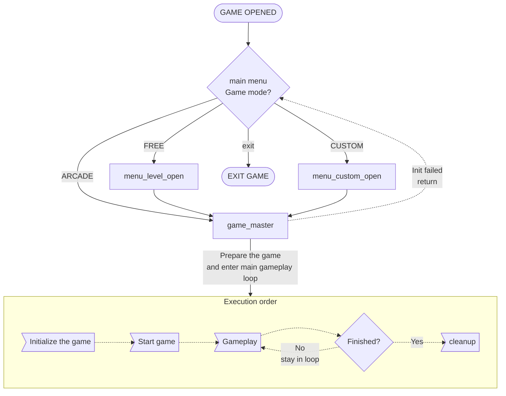
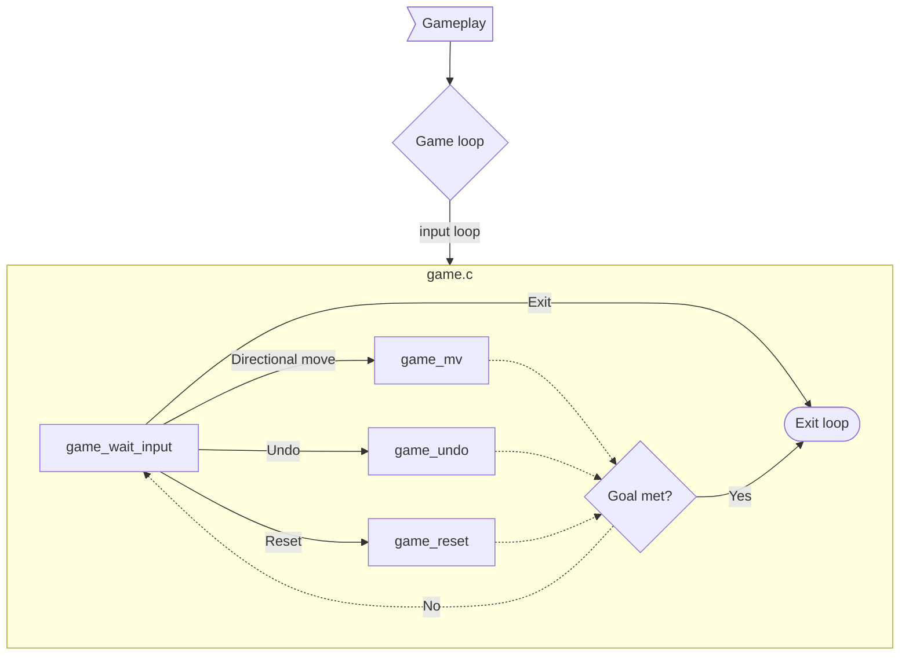

# SCHOKOBAN - DEVELOPER'S DOCUMENTATION

## 1 Legal & License
Copyright (c) 2023 Zsombor Török

This program is free software: you can redistribute it and/or modify
it under the terms of the GNU General Public License as published by
the Free Software Foundation, either version 3 of the License, or
(at your option) any later version.

This program is distributed in the hope that it will be useful,
but WITHOUT ANY WARRANTY; without even the implied warranty of
MERCHANTABILITY or FITNESS FOR A PARTICULAR PURPOSE.  See the
GNU General Public License for more details.

You should have received a copy of the GNU General Public License
along with this program.  If not, see <http://www.gnu.org/licenses/>.

## 2 Intro
It is Sokoban but spelled with sch because Schönherz.

This developer's documentation is only a complementary 
resource to the already documented source code.

GitHub repository for the project: 
[zsotroav/Schokoban](https://github.com/zsotroav/schokoban)

## 3 High-level overview

### 3.1 Files
The project follows a simple folder structure with C source code in the 
`src` directory and related header files in the `include` directory.
```
schokoban
├── src
|   ├── data.c                // Basic data handling
|   ├── game.c                // Main gameplay logic
|   ├── io_level.c            // Level (XSB) file path and location handling
|   ├── io_map.c              // Level (XSB) file reading
│   ├── main.c                // Main entry code and gameplay loop
|   ├── menu_custom.c         // Custom map select menu handling
|   ├── menu_level_handle.c   // Level select menu handling
|   ├── menu_level_printer.c  // Level select menu printer functions
|   ├── menu_main_handle.c    // Main menu movement handling
|   ├── menu_main_printer.c   // Main menu printer functions
|   └── printer.c             // Game UI Handling
├── include
|   ├── lib                   // Libraries
|   |   ├── debugmalloc.h
|   │   ├── ECONIO_LICENSE    // MIT License file for the econio library
|   │   ├── econio.c
|   │   └── econio.h
|   ├── config.h        // Global configuration constants (instead of .ENV)
|   └── ...
├── .gitignore
├── CMakeLists.txt
├── DEV_DOC.md
├── econio_readme.md    // Readme for econio lib may get removed in the future
├── LICENSE             // GPL-3.0 (License file)
├── spec_ui.png
└── spec.md             // Specifications for the game
```

### 3.2 Used external resources
- Libraries:
  1. [c-econio](https://infoc.eet.bme.hu/megjelenites/c-econio.zip) 
    by Zoltan Czirkos. [MIT License](include/lib/ECONIO_LICENSE)
  2. [debugmalloc](https://infoc.eet.bme.hu/debugmalloc/debugmalloc.h)
- Code snippets: Noted in source if applicable
- General reference documents:
  1. [Sokoban.org](http://sokoban.org/about_sokoban.php) for game rules 
     and XSB/LURD format specs
- Miscellaneous: 
   1. ASCII font for logo: tmplr by Eugene Ghanizadeh Khoub, 
   generated with [patorjk.com](https://patorjk.com/software/taag/#p=display&h=1&v=2&f=Tmplr&t=SCHOKOBAN)

### 3.3 Data structure

#### 3.3.1 map data
Defined in `data.h`, `struct map_data` contains all stored information about
the currently loaded level/map. Most function calls require a `map_data`
pointer to operate. 

| tpye      | field      | description                                     |
|-----------|------------|-------------------------------------------------|
| int       | level      | Level number used if the game type is arcade.   |
| char*     | loc        | Location of the map data file.                  |
| map_char* | map        | Display data.                                   |
| int       | width      | Map's width.                                    |
| int       | height     | Map's height.                                   |
| fame*     | fame_list  | Fame List                                       |
| char*     | title      | Map's title metadata.                           |
| char*     | author     | Map's author metadata.                          |
| bool      | functional | Indicate if an internal error was encountered.  |
| int       | move_cnt   | Number of moves made 
(to not have to traverse the linked list each time it's needed)            |
| move*     | moves      | List of made moves.                             |
| int       | player_x   | Player character's current X location.          |
| int       | player_y   | Player character's current Y location.          |
| int       | box        | Number of boxes not on goals yet.               |

#### 3.3.2 move type
Defined in `data.h`, `enum move_type` is an enum for the types of moves possible
in the LURD format. Each possible state has an assigned char value as well.

| enum | char | decription              |
|------|------|-------------------------|
| MV_L | L    | Left (box moved)        |
| MV_U | U    | Up (box moved)          |
| MV_R | R    | Right (box moved)       |
| MV_D | D    | Down (box moved)        |
| MV_l | l    | Left                    |
| MV_u | u    | Up                      |
| MV_r | r    | Right                   |
| MV_d | d    | Down                    |
| MV_UNDO | x | Undo                    |
| MV_INV  |   | Invalid move (reserved) |

#### 3.3.3 move
Defined in `data.h`, `struct move` is a double linked list for storing the list
of moves made by the player on the current level

| type      | field | description        |
|-----------|-------|--------------------|
| move_type | type  | Type of move made  |
| move*     | prev  | Previous list item |
| fame*     | next  | Next list item     |

<div class="page"></div>

#### 3.3.4 fame
Defined in `data.h`, `struct fame` is a linked list for storing the fame list

| type  | field | description               |
|-------|-------|---------------------------|
| char* | name  | Name of the player        |
| int   | move  | Number of moves           |
| fame* | next  | Pointer to next list item |

<div class="page"></div>

## 4 Code and logic structure
The following figures show a high-level (simplified) overview of the game's
underlying logic and structure, showing only the important connections and
relations. 

Solid lines represent function calls, while dotted lines show code execution
order; highlighted boxes are drawn around functions from the same file or for
visual separation.


### 4.1 Entry and gameplay loop
See Figures 4.2-4.6 for a more detailed overview of the main gameplay loop. 



### 4.2 Game initialization


### 4.3 Start game


### 4.4 Gameplay
One of `main.c`'s primary functions is to handle the gameplay loop: 
`game.c :: game_wait_input()` is called continuously in a loop until the game
ends or the user exits the level. This function handles waiting for inputs and
calling the logic functions related to the input.



### 4.5 Cleanup


### 4.6 Process fame list entry


## 5 Functions
The following section was generated with 
[docblox2md](https://github.com/vphantom/docblox2md) from the header files.

### 5.1 data.h
<!-- BEGIN DOC-COMMENT H4 include/data.h -->

#### `char* read_text()`

Read long string from stdin
**Returns:** `read` — text

#### `map_data* map_init(char* loc, int width, int height)`

Create a new map instance with default values

**Parameters:**

* `Default` — `loc` — value for map_data.loc
* `Width` — `width` — of the map for allocation
* `Height` — `height` — of the map for allocation

**Returns:** `Created` — and memory allocated map_data pointer

#### `move* get_next_move(move* prev)`

Insert a new move at the end of the current chain

**Parameters:**

* `Any` — `prev` — point of the current move chain

**Returns:** `The` — new element

#### `fame* add_new_fame(fame* prev)`

Insert new fame list item after a given one

**Parameters:**

* `Element` — `prev` — to insert after

**Returns:** `The` — new element

#### `fame* insert_fame_at(fame* first, int n, char* name, int move)`

Insert new fame list item after the n.th one\n

**Parameters:**

* `List` — `first` — item to count from
* `to` — `Index` — insert at
* `List` — `name` — item name value
* `List` — `move` — item move value

**Returns:** `First` — item

<!-- END DOC-COMMENT -->

### 5.3 io_level.h
<!-- BEGIN DOC-COMMENT H4 include/io_level.h -->

#### `io_level_fullpath(id)`

Get the number of xsb files in the directory 

**Note:** This function does not validate if the XSB files are valid 

**Parameters:**

* `Directory` — `directory` — to search in 

**Returns:** The number of xsb files 

#### `int io_level_parse(char* directory)`

Get the full path based on config directory

**Parameters:**

* `ID` — `id` — of the map file

**Returns:** `full` — (relative) path to the XSB

#### `char* io_level_get(char* directory, int id)`

Get the file name of the map with a specific id

**Parameters:**

* `Directory` — `directory` — to search in
* `Number` — `id` — of the map file

**Returns:** `File` — name

<!-- END DOC-COMMENT -->

### 5.4 io_map.h
<!-- BEGIN DOC-COMMENT H4 include/io_map.h -->

#### `FILE* get_meta_file(char* loc, char* mode, bool stat)`

Open stats/save state file, which is just the xsb map file with .dat/.sav at the end

**Parameters:**

* `Location` — `loc` — of the XSB file
* `File` — `mode` — open mode
* `true` — `stat` — = stats file // false = save file

**Returns:** `File` — pointer to the stats file

#### `char* read_long(FILE* fptr)`

Read undefined length line

**Parameters:**

* `File` — `fptr` — pointer to read from

**Returns:** `Malloced` — string

#### `bool map_load_stats(map_data *map)`

Load the stats (leaderboard) of the map from the appropriate data file

**Parameters:**

* `Pointer` — `map` — to map data

**Returns:** `Success` — or Failure to load.

#### `bool map_save_moves(map_data *map)`

Save the moves of the map to the appropriate data file

**Parameters:**

* `Pointer` — `map` — to map data

**Returns:** `Success` — or Failure to save.

#### `void map_load_moves(map_data *map, FILE* savptr)`

Load the moves of the map from the data file

**Parameters:**

* `Pointer` — `map` — to map data
* `FILE*` — `savptr` — to save file

#### `bool map_save_stats(map_data *map)`

Save the stats of the map into the appropriate data file

**Parameters:**

* `Pointer` — `map` — to map data

**Returns:** `Success` — or Failure to save.

#### `bool meta_exists(char* meta, FILE* fptr)`

Check if given metadata value is in the file at the expected location

**Parameters:**

* `Metadata` — `meta` — name
* `XSB` — `fptr` — file pointer

**Returns:** `true/false` — based on result

#### `map_data* map_open(char *loc)`

Opens the given map file

**Parameters:**

* `relative` — `loc` — or absolute path to the xsb map file

**Returns:** `generated` — map data

#### `void map_load(map_data *map, FILE* mapptr)`

Loads the contents of the map. Must always be called after map_open()

**Parameters:**

* `Pointer` — `map` — to map data
* `file` — `mapptr` — pointer to map file

**Returns:** `Success` — or Failure to load map data.

#### `void map_reset(map_data *map)`

Lazily (only doing what's necessary) resets the map from the map file

**Parameters:**

* `Pointer` — `map` — to map data

#### `void map_close(map_data *map)`

Closes the map file and frees all allocated memory for the map

**Parameters:**

* `Pointer` — `map` — to map data

<!-- END DOC-COMMENT -->

### 5.5 menu_custom.h
<!-- BEGIN DOC-COMMENT H4 include/menu_custom.h -->

#### `char* menu_custom_open()`

Open the custom map input menu
**Returns:** `The` — user provided (!) path

<!-- END DOC-COMMENT -->

### 5.6 menu_level_handle.h
<!-- BEGIN DOC-COMMENT H4 include/menu_level_handle.h -->

#### `void menu_level_highlight(int id, int page, int max, bool active)`

Highlight level menu item

**Parameters:**

* `ID` — `id` — of the menu item (location on page)
* `Current` — `page` — page in view (for number calculation)
* `Maximum` — `max` — number of available levels (any more is greyed out)
* `State` — `active` — to highlight

#### `bool menu_level_move(int* loc, int* page, int max)`

Move level selection

**Parameters:**

* `Current` — `loc` — location
* `Current` — `page` — page
* `Maximum` — `max` — number of available levels

**Returns:** `Selection` — complete: false (to break out of loop)

#### `int menu_level_open()`

Open level select menu and wait for completed selection
**Returns:** `Selected` — level's number

<!-- END DOC-COMMENT -->

### 5.7 menu_level_printer.h
<!-- BEGIN DOC-COMMENT H4 include/menu_level_printer.h -->

#### `void menu_print_level_nav(bool direction, int color)`

Print navigation block in level select menu

**Parameters:**

* `ture:` — `direction` — Right // false: Left
* `(econio)` — `color` — color to print with

#### `void menu_print_level_item(int num, int color, int id)`

Print a single item on the level screen

**Parameters:**

* `Number` — `num` — to show
* `(econio)` — `color` — color to print with
* `Sequential` — `id` — ID of the button

#### `void menu_print_level_page(int page, int max)`

Print the full page of levels (loop through menu_print_level_item)

**Parameters:**

* `Page` — `page` — no. to  print
* `Maximum` — `max` — number of levels, any more is greyed out 00

#### `bool menu_print_level(int page, int max)`

Print the full level selection screen

**Parameters:**

* `Page` — `page` — to start printing at
* `Maximum` — `max` — number of levels, any more is greyed out 00

**Returns:** Success/Failure

<!-- END DOC-COMMENT -->

### 5.8 menu_main_handle.h
<!-- BEGIN DOC-COMMENT H4 include/menu_main_handle.h -->

#### `bool menu_main_move(game_type* type_loc)`

Main menu movement looper

**Parameters:**

* `Current` — `type_loc` — selection

**Returns:** `Selection` — complete: false (to break out of loop)

#### `game_type menu_main_open()`

Open main menu and wait for game type selection
**Returns:** `Selected` — game type or exit request

<!-- END DOC-COMMENT -->

### 5.9 menu_main_printer.h
<!-- BEGIN DOC-COMMENT H4 include/menu_main_printer.h -->

#### `void menu_main_print_highlighted(int id, bool highlighted)`

Print a single item on the main menu

**Parameters:**

* `ID` — `id` — of the menu item (location)
* `Highlight` — `highlighted` — selection active/inactive

#### `void menu_main_print()`

Print the full main menu

<!-- END DOC-COMMENT -->

### 5.10 printer.h
<!-- BEGIN DOC-COMMENT H4 include/printer.h -->

#### `void printnat(int x, int y, int n, char* c)`

Print a given number of characters at a location

**Parameters:**

* `X` — `x` — (Horizontal) location
* `Y` — `y` — (Vertical) location
* `Number` — `n` — of times to print character
* `Character` — `c` — to print

#### `void printat(int x, int y, char* c)`

Print a character at location

**Parameters:**

* `X` — `x` — (Horizontal) location)
* `Y` — `y` — (Vertical) location
* `Character` — `c` — to print

#### `void print_all(map_data *map)`

Prints the full game to the screen

#### `void print_map_all(map_data *map)`

Prints every map component to the screen

#### `void print_xy(map_data *map, int x, int y)`

Prints the current value to the screen at the given location of the map, does not offset the print, prints wherever we're currently at

**Parameters:**

* `Map` — `x` — location x
* `Map` — `y` — location y

#### `void print_xy_offset(map_data *map, int x, int y)`

Prints the current value to the screen at the given location of the map, with the appropriate amount of offset

**Parameters:**

* `Map` — `x` — location of x
* `Map` — `y` — location of y

#### `void print_meta(map_data* map)`

Print the logo and available map metadata (title, author, record)

**Parameters:**

* `Pointer` — `map` — to map data

#### `void print_update_move(int new)`

Update the number of moves displayed

**Parameters:**

* `New` — `new` — number to show

#### `void print_controls()`

Prints the control hints to the screen at current cursor position

#### `void print_leaderboard(map_data* map)`

Print the leaderboard of the map

**Parameters:**

* `Pointer` — `map` — to map data

<!-- END DOC-COMMENT -->
