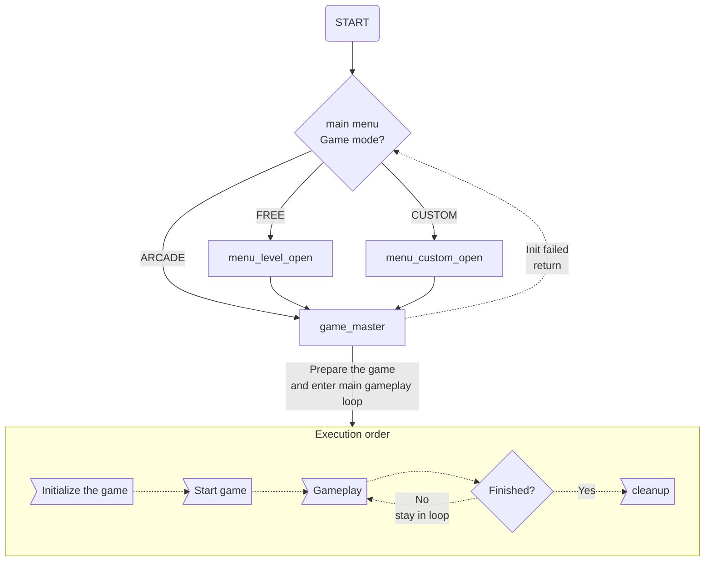
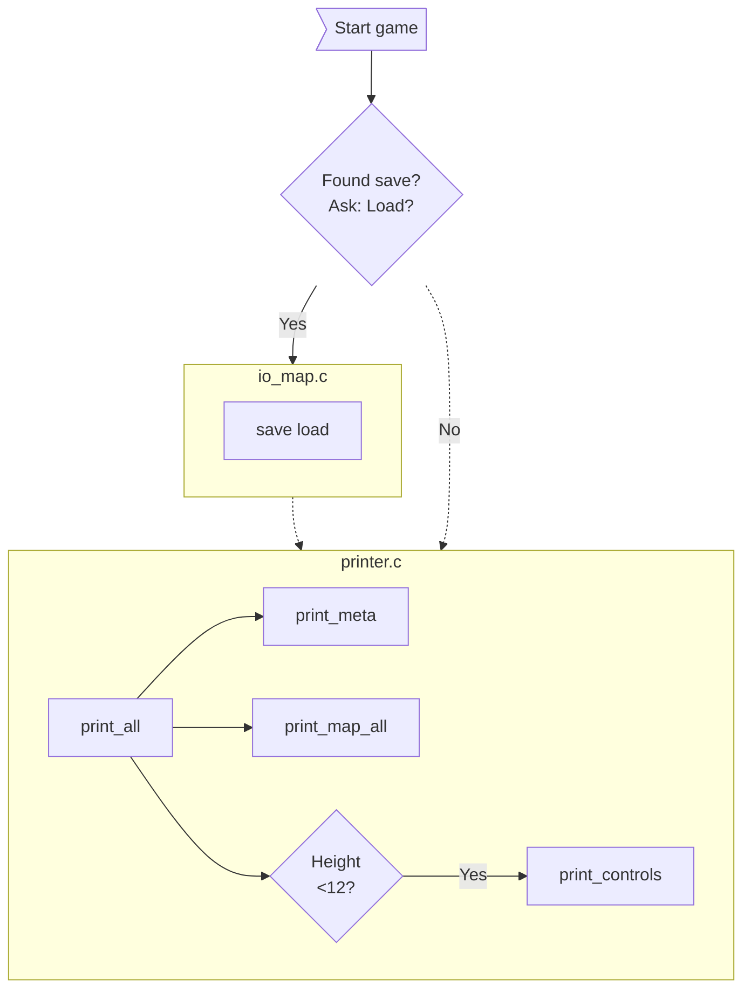
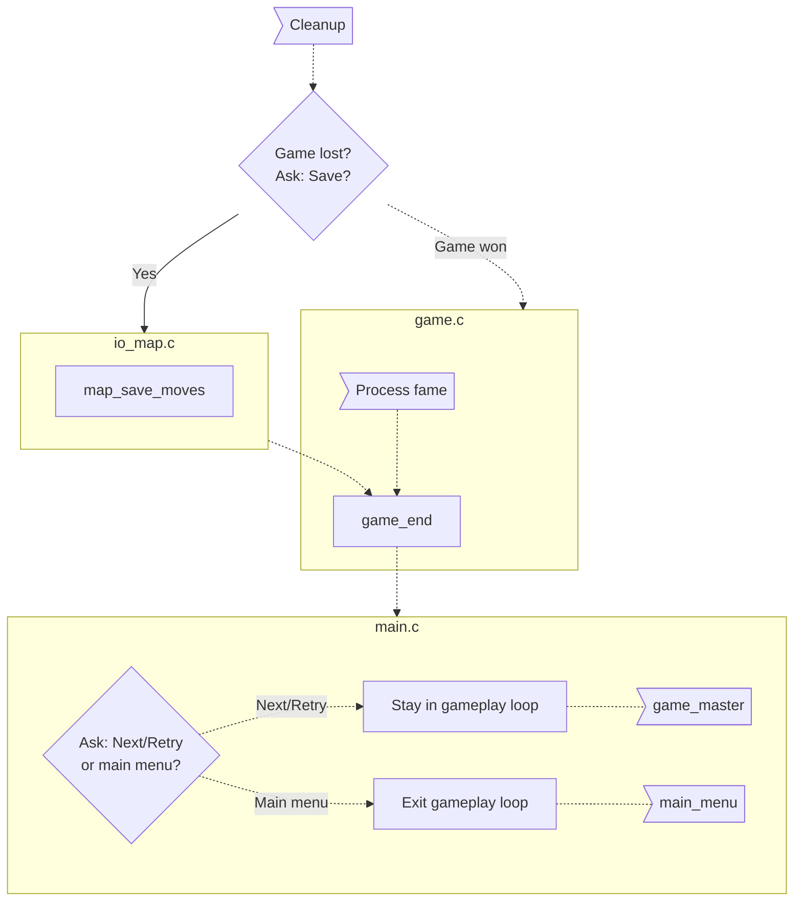
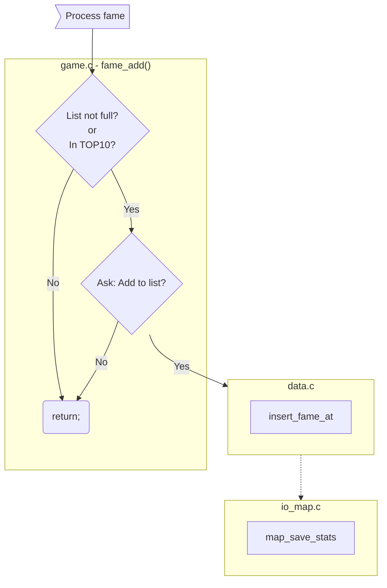

# SCHOKOBAN - DEVELOPER'S DOCUMENTATION

## 1 Legal & License
Copyright (c) 2023 Zsombor Török

This program is free software: you can redistribute it and/or modify
it under the terms of the GNU General Public License as published by
the Free Software Foundation, either version 3 of the License, or
(at your option) any later version.

This program is distributed in the hope that it will be useful,
but WITHOUT ANY WARRANTY; without even the implied warranty of
MERCHANTABILITY or FITNESS FOR A PARTICULAR PURPOSE.  See the
GNU General Public License for more details.

You should have received a copy of the GNU General Public License
along with this program.  If not, see <http://www.gnu.org/licenses/>.

## 2 Intro
It is Sokoban but spelled with sch because Schönherz.

This developer's documentation is only a complementary 
resource to the already documented source code.

GitHub repository for the project: 
[zsotroav/Schokoban](https://github.com/zsotroav/schokoban)

## 3 High-level overview

### 3.1 Files
The project follows a simple folder structure with C source code in the 
`src` directory and related header files in the `include` directory.
```
schokoban
├── src
|   ├── data.c                // Basic data handling
|   ├── game.c                // Main gameplay logic
|   ├── io_level.c            // Level (XSB) file path and location handling
|   ├── io_map.c              // Level (XSB) file reading
│   ├── main.c                // Main entry code and gameplay loop
|   ├── menu_custom.c         // Custom map select menu handling
|   ├── menu_level_handle.c   // Level select menu handling
|   ├── menu_level_printer.c  // Level select menu printer functions
|   ├── menu_main_handle.c    // Main menu movement handling
|   ├── menu_main_printer.c   // Main menu printer functions
|   └── printer.c             // Game UI Handling
├── include
|   ├── lib                   // Libraries
|   |   ├── debugmalloc.h
|   │   ├── ECONIO_LICENSE    // MIT License file for the econio library
|   │   ├── econio.c
|   │   └── econio.h
|   ├── config.h        // Global configuration constants (instead of .ENV)
|   └── ...
├── .gitignore
├── CMakeLists.txt
├── DEV_DOC.md
├── econio_readme.md    // Readme for econio lib may get removed in the future
├── LICENSE             // GPL-3.0 (License file)
├── spec_ui.png
└── spec.md             // Specifications for the game
```

### 3.2 Used external resources
- Libraries:
  1. [c-econio](https://infoc.eet.bme.hu/megjelenites/c-econio.zip) 
    by Zoltan Czirkos. [MIT License](include/lib/ECONIO_LICENSE)
  2. [debugmalloc](https://infoc.eet.bme.hu/debugmalloc/debugmalloc.h)
- Code snippets: Noted in source if applicable
- General reference documents:
  1. [Sokoban.org](http://sokoban.org/about_sokoban.php) for game rules 
     and XSB/LURD format specs
- Miscellaneous: 
   1. ASCII font for logo: tmplr by Eugene Ghanizadeh Khoub, 
   generated with [patorjk.com](https://patorjk.com/software/taag/#p=display&h=1&v=2&f=Tmplr&t=SCHOKOBAN)

## 4 Code and logic structure
The following figures show a high-level (simplified) overview of the game's
underlying logic and structure, showing only the important connections and
relations. 

Solid lines represent function calls, while dotted lines show code execution
order; highlighted boxes are drawn around functions from the same file or for
visual separation.


### 4.1 Entry and gameplay loop
See Figures 4.2-4.6 for a more detailed overview of the main gameplay loop. 



### 4.2 Game initialization


### 4.3 Start game


### 4.4 Gameplay
One of `main.c`'s primary functions is to handle the gameplay loop: 
`game.c :: game_wait_input()` is called continuously in a loop until the game
ends or the user exits the level. This function handles waiting for inputs and
calling the logic functions related to the input.


### 4.5 Cleanup


### 4.6 Process fame list entry

