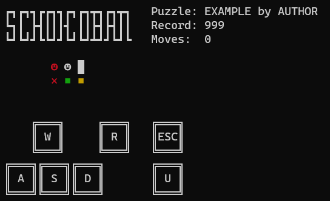

# SCHOKOBAN - PROGRAM SPECIFICATION

## About Sokoban
Sokoban (倉庫番, Sōko-ban) is a single-player puzzle game where the player pushes
boxes around in a warehouse.

### Objective and rules
The objective is to push all boxes onto storage location(s), also
called goals. The player can push a box in any direction as long as it is not
obstructed by another box or a wall. The player may undo their moves an
unlimited number of times. (using undo repeatedly should "roll back time")

The location of the boxes and the storage locations are set by the map's author
and are always in the same location on a map. The game consists of multiple
levels with varying difficulty determined by the number of boxes and the
complexity of the solution to the puzzle.

### Scoring
The player's score is the number of moves they made to complete the map:
- Any successful directional move, including box pushes, count as one
- Undos also count as moves
- Map resets also reset the move counter

A lower score (fewer amount of moves) is better. 

## Game behavior

### Appearance
The game is playable through a console/terminal window with colorful Unicode
characters representing each of the six possible states on any given playing
field:

- `█` (`U+2588` "Full Block") for the walls
- `⨯` (`U+2A2F` "Cross Product") colored *red* for the goals
- `◼` (`U+25FC` "Black Medium Square") for the boxes
  - colored *yellow* for boxes not on goals
  - colored *green* for boxes on goals
- `☻` (`U+263B` "Black Smiling Face") for the player character/figure
  - colored *red* if standing on a goal

### Starting the game
When opening the game, a logo and menu is displayed, asking the player what
mode they want to play in:
- **Arcade mode:** The levels are played in a set order, one after another.
- **Free play:** The player can choose a level to play from arcade mode.
- **Custom maps:** The player can input a path to any standard XSB map file to
be loaded and played.

### Loading a saved game
If a saved state can be found for the selected level, the player is offered the
option to load or delete the saved state.

### The end of the game
If the player's score surpasses or matches any of those in the current
leaderboard, the player can choose whether or not they want to appear on the
leaderboard. If they want to appear, they are asked to input a nickname;
the new list is saved and displayed.

>***Note:** The leaderboard may only contain a maximum of 10 entries and is
'first come, first served' when there is a tie. The leaderboard shows the
scores ordered from best (lowest) to worst (highest) and the best visually
separated*

When the player completes or quits a map, they are shown the leaderboard first
before being asked if they want to:
- **Arcade mode:** Continue to the next map or the main menu
- **Free play/Custom modes:** Play again or exit to the main menu

### Controls
The player doesn't need to choose a control scheme; all options should work
for all actions:
- **Directional input:** `WASD` or arrow keys
  - Game controls
  - Menu navigation
- **Accept:** `Enter` or `Space`
  - Confirm choices in the menu
- **Menu exit:** `Escape` or `Backspace`
  - Exiting from the game (show leaderboard and exit menu): `Escape`
- **Map reset:** `R`
- **Move undo:** `U`

### Gameplay - UI
During gameplay, the UI consists of:
- The game's logo
- The map's title and author
  - If the title is unknown, the map's file name is displayed without an author
- The best score based on the leaderboard for the map 
  - `N/A` if there are no entries in the leaderboard
- The player's current move count
- The map as described in the appearance section
- Control hints if there is enough enough space (the map isn't too tall)

<div class="page"></div>

## File formats

### XSB map
Official description: [sokoban.org](http://sokoban.org/about_sokoban.php)

The XSB file stores the level data in plaintext using the following characters:

| Character               | Meaning     |
|-------------------------|-------------|
| `@`                     | Man         |
| `+`                     | Man on goal |
| `$`                     | Box         |
| `*`                     | Box on goal |
| `#`                     | Wall        |
| `.`                     | Goal        |
| `_` or `-` or (Space)   | Floor       |

Two optional lines may follow the level data with the Title and Author
information for the level. 

One XSB file stores one level.

#### Example level:
```
+ @ #
. * $ 
Title: EXAMPLE
Author: AUTHOR
```

### Leaderboard data
The leaderboard data is stored next to the `level.xsb` file in a 
`level.xsb.dat` file with the same file name (`level`) and the `.xsb.dat`
file extension. 

The leaderboard is stored in plaintext, where every line is an entry in the
leaderboard. The best (lowest) score is the first entry, and the worst
(highest) is the last. Every line begins with the score number followed by the
player's chosen nickname.

#### Example leaderboard: 
```
10 Foo Bar
12 Baz
30 John Doe
```

### State save file
The save state is stored next to the `level.xsb` file in a `level.xsb.sav` file
with the same file name `level` and the `.xsb.sav` file extension.

The save is stored in plaintext using the LURD format:

| Box push | Movement | Direction |
|----------|----------|-----------|
| L        | l        | Left      |
| U        | u        | Up        |
| R        | r        | Right     |
| D        | d        | Down      |

An additional character (`x`) is used to indicate an undo.

#### Example save file:
```
ulUdrruRRxD
```

## Images

